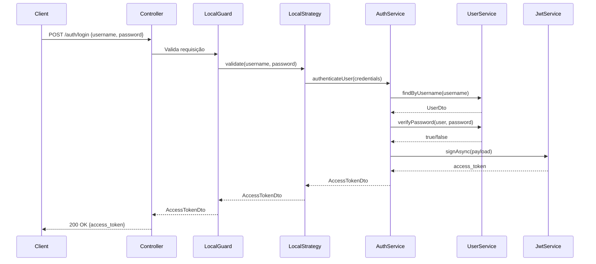
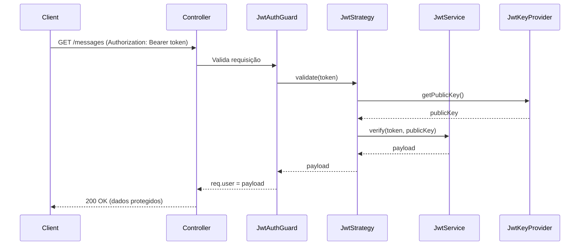

# Autenticação

## Sumário

- [Visão Geral](#visão-geral)
- [Benefícios](#benefícios)
- [Passport](#passport)
- [Guards](#guards)
- [Fluxo de Autenticação](#fluxo-de-autenticação)
  - [Componentes principais](#componentes-principais)
  - [Login (Obtenção do Token)](#login-obtenção-do-token)
  - [TBD - Acesso a Rota Protegida](#tbd---acesso-a-rota-protegida)
- [Referências](#referências)

---

## Visão Geral

Implementei um sistema de autenticação baseado em JWT (JSON Web Tokens) utilizando a biblioteca Passport usando Strategy e Guards do NestJS para proteção de rotas.

---

## Benefícios

- **Identificação de Usuários**: Verifica quem está acessando o sistema
- **Controle de Acesso**: Define quais recursos cada usuário pode acessar
- **Proteção de Dados Sensíveis**: Impede acessos não autorizados a informações e ações
- **Criptografia assimétrica (RS256)**: Maior segurança na assinatura e verificação de tokens
  - Chave privada assina o token (servidor)
  - Chave pública verifica o token (pode ser compartilhada)
- **Cache em memória das chaves RSA**: Reduz latência e melhora performance sem comprometer segurança

---

## Passport

[Passport](https://www.passportjs.org/) é um middleware de autenticação para Node.js extremamente flexível e modular.
Por meio dele, fiz uso do design pattern **Strategy**, o qual possibilita definir como a autenticação será realizada de forma desacoplada.
Desta forma, pude consumir uma interface consistente para diferentes métodos de autenticação, tais como:

### Local Strategy

- **Propósito**: Autenticação com `username` e `password`
- **Uso**: Endpoint de login
- **Fluxo**: Valida credenciais e retorna token JWT

### JWT Strategy

- **Propósito**: Validação de tokens JWT
- **Uso**: Proteção de futuras rotas autenticadas (ex: `messages`)
- **Fluxo**: Extrai e valida token do header Authorization

---

## Guards

Guards são classes que determinam se uma requisição pode prosseguir ou não, estando localizados na cama de controle de acesso (depois dos Middleware e antes dos Interceptors, Pipes e Controller).

Com eles, posso controlar o acesso a rotas específicas com base em regras de negócio, como autenticação e autorização por roles.

Com os Guards, uso o `canActivate()` que é chamado automaticamente pelo NestJS e faz uso das Strategies do Passport para validar as requisições. Se a validação falhar, o NestJS retorna um erro 401 Unauthorized.

Com isso, foi utilizada a mesma lógica para os strategies, e criei um LocalGuard para proteger a rota de login e um JwtAuthGuard para proteger as rotas autenticadas.

---

## Fluxo de Autenticação

### Componentes Principais

| Componente       | Responsabilidade                               |
| ---------------- | ---------------------------------------------- |
| `AuthController` | Expõe endpoints de autenticação                |
| `AuthService`    | Lógica de negócio de autenticação              |
| `UserService`    | Gerenciamento de usuários (sem Banco de Dados) |
| `JwtKeyProvider` | Carrega chaves RSA públicas/privadas           |
| `LocalStrategy`  | Valida username/password                       |
| `JwtStrategy`    | Valida tokens JWT                              |
| `LocalGuard`     | Protege rota de login                          |
| `JwtAuthGuard`   | Protege rotas autenticadas                     |

### Login (Obtenção do Token)

**Passo a passo:**

1. Cliente envia credenciais para `/auth/login`
2. `LocalGuard` intercepta a requisição
3. `LocalStrategy.validate()` é invocado com username e password
4. `AuthService.authenticateUser()` processa a autenticação:
   - Busca usuário no banco de dados
   - Verifica a senha
   - Gera payload JWT com informações do usuário
5. `JwtService` assina o token com a chave privada RSA
6. Token JWT é retornado ao cliente

---

### TBD - Acesso a Rota Protegida

**Passo a passo:**

1. Cliente envia requisição com token no header `Authorization`
2. `JwtAuthGuard` intercepta a requisição
3. `JwtStrategy.validate()` é invocado automaticamente
4. Token é extraído do header: `Bearer <token>`
5. `JwtKeyProvider` fornece a chave pública RSA
6. Token é verificado e decodificado
7. Payload do token é anexado a `req.user`
8. Controlador tem acesso aos dados do usuário autenticado

---

## Referências

- [NestJS Authentication](https://docs.nestjs.com/security/authentication)
- [Passport.js](http://www.passportjs.org/)
- [JWT.io](https://jwt.io/)
